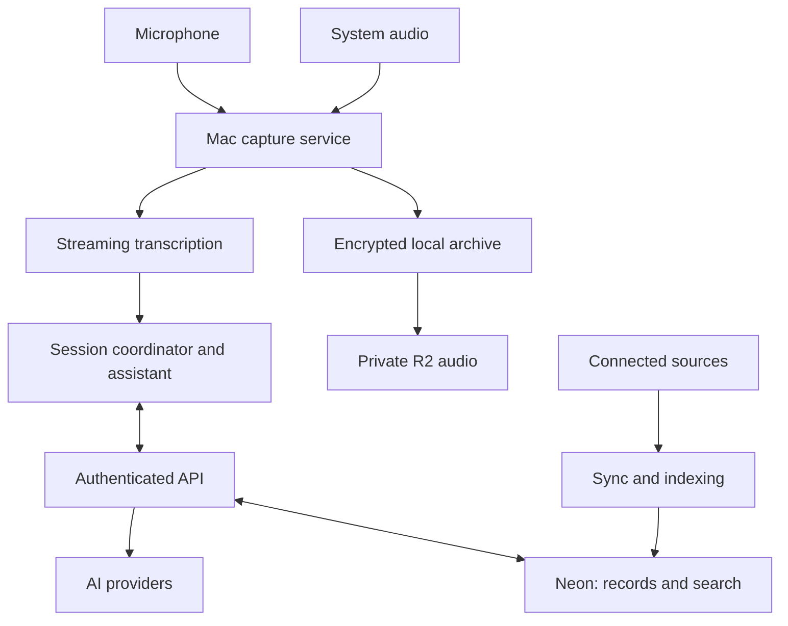

# Sidebrief

Live context. Useful answers. Your meeting, remembered.

Sidebrief is a native macOS meeting copilot. It listens to your microphone and Mac system audio, transcribes the conversation, and helps you decide what to say while the meeting is still happening. It keeps the recording and meeting history, and brings relevant information from previous meetings, email, Google Drive, Slack, and GitHub into the conversation.

Initially built for Kevin O’Connor’s personal use. Broader distribution is an option after the app proves useful. A web app can follow later.

## Project status

**Production-Ready Baseline Implemented & Verified on macOS 26 / Apple Silicon.**

The core native macOS application, dual-audio capture pipeline, live streaming STT, LLM copilot engine, Neon PostgreSQL database, Cloudflare R2 audio storage, multiple email accounts support, editable/bootstrapped memory manager, and build/packaging scripts are fully implemented, verified, and passing 100% of automated tests.

**Document** | **Purpose** |
--- | --- |
AGENTS.md | Implementation instructions for coding agents and contributors |
MEMORY.md | Durable decisions, verified milestones, test outcomes, and active state |
STACK.md | Technology stack, frameworks, tools, and versions |
docs/REQUIREMENTS.md | Detailed functional requirements, architecture, data model, and acceptance criteria |
Sidebrief.entitlements | macOS App entitlements (microphone access, network client) |

## The experience

- Start a meeting, choose its context space, and verify the microphone and system-audio meters. Sidebrief displays a live transcript and a floating assistant panel beside your meeting window.
- The panel offers three ways to get help:
- Automatic suggestions: frequent, context-aware responses, questions, objections, and relevant facts. The initial cadence is approximately 8–12 seconds during substantive discussion, with direct questions triggering assistance sooner.
- Help me answer: a configurable global shortcut that prioritizes the question currently being discussed.
- Chat: ask your own question, inspect a statement, or request a deeper explanation during or after the meeting.
- Each suggestion can include a concise recommended response and two useful alternatives. Pin a response while reading it, expand the evidence, request a shorter version, or ask a follow-up. New suggestions must never steal focus or move a pinned card.
- Afterward, review timestamp-linked audio, an editable transcript, a summary, decisions, commitments, and unresolved questions. Search prior meetings and connected sources without manually collecting everything into a prompt.
## Installation

### Homebrew (Recommended)

Install Sidebrief with one command:

```bash
brew install KevinOBytes/sidebrief/sidebrief
```

Or tap the repository first:

```bash
brew tap KevinOBytes/sidebrief
brew install --cask sidebrief
```

### Direct Download

Download the latest signed release directly from [GitHub Releases](https://github.com/KevinOBytes/sidebrief/releases/latest):
* [Download Sidebrief.dmg (v1.0.1)](https://github.com/KevinOBytes/sidebrief/releases/download/v1.0.1/Sidebrief.dmg)

## Core requirements

### Capability

- Intended behavior

### Dual audio

- Capture microphone and macOS system audio simultaneously on independent synchronized tracks

### Recording reliability

- Continue recording locally through network/provider outages; recover finalized chunks after a crash

### Live transcription

- Show provisional and finalized segments, timestamps, source track, and speaker labels where supported

### Frequent assistance

- Automatic suggestions, manual shortcut, and chat with meaningful alternatives

### Evidence

- Distinguish sourced facts, discussion-derived statements, inference, and missing information

### Memory

- Retrieve current and previous meetings plus relevant connected documents within permitted scope

### Connectors

- Email, Google Drive, Slack, and GitHub; read-only initially

### Retention

- Keep audio, transcripts, summaries, and assistant history until deletion or an explicit retention rule

### Native UX

- SwiftUI main window, AppKit floating panel, menu-bar controls, native settings and keyboard navigation

### Portability

- Export audio, Markdown, JSON, and SRT/VTT with timestamps and provenance

### Context spaces

- Separate professional and personal sources; cross-space retrieval requires explicit selection

All requested connectors remain in scope. They follow the working capture/copilot loop in implementation order.

### Architecture

The Mac owns capture and the live session. Cloud services support transcription, inference, synchronized history, and retrieval. Recording never waits for Neon, object storage, or an AI provider.



## Layer

- Proposed implementation

### Native client

- Swift, SwiftUI, AppKit, ScreenCaptureKit, AVFoundation

### Local data

- Encrypted SQLite, encrypted audio chunks, durable synchronization outbox

### Structured cloud data

- Neon PostgreSQL with full-text search and pgvector

### Audio storage

- Private Cloudflare R2; object manifests and access scope in Neon

### Backend

- TypeScript API on Cloudflare Workers; Queues for asynchronous jobs

### First STT candidate

- ElevenLabs realtime transcription, subject to latency and accuracy testing

### First generation candidate

- OpenRouter with separately configurable fast-answer and deeper-analysis models

### Other provider targets

- OpenAI and Cloudflare AI, using explicit capability-specific adapters

### Authentication

- OIDC with PKCE, system-browser sign-in, revocable device sessions

Provider names describe proposed integrations, not implemented adapters. Model IDs, prices, and supported capabilities must be verified when implementation begins. Do not hardcode a vendor’s marketing claim as a service guarantee.

Neon is the authoritative synchronized database. SQLite is the local working store and offline queue. Audio belongs in object storage, with a retained local copy until successful upload and according to the local cache policy.

## Data boundaries

- Microphone and system audio have independent capture controls and health indicators. Muting a meeting app does not necessarily stop Sidebrief from capturing the microphone.
- System capture can contain other application audio. Application filtering must be tested; generic system capture does not guarantee browser-tab isolation.
- Separate local and remote tracks do not identify individual remote speakers. Use anonymous labels until identity is supported or corrected.
- Source access does not automatically authorize sharing its contents with meeting attendees or a particular AI provider.
- Use restricted provider routing for sensitive spaces. Provider failure must not silently loosen the data policy.
- API keys, database credentials, OAuth tokens, recordings, and real transcripts never belong in the repository.
- Cloud search and inference process readable content. Do not market this design as end-to-end encrypted against the service operator.
- The first release reads sources and drafts responses. It does not send emails, post Slack messages, change repositories, or speak for the user.

## Verified Build, Test & Run Commands

Sidebrief includes automated scripts verified on macOS 26 / Apple Silicon:

### 1. Build Entire Stack (Native App + Backend)
```bash
./scripts/build.sh
```
Compiles the TypeScript backend (`npm run build` in `backend/`) and compiles the native Swift package in release mode (`swift build -c release`).

### 2. Run Comprehensive Test Suite
```bash
./scripts/test.sh
```
Executes all 12 native Swift unit and integration tests (Audio capture pipelines, CryptoKit AES-GCM encryption roundtrips, Keychain storage, crash recovery with gap detection, STT adapters, and SQLite stores) in ~0.08s, followed by the backend integration test suite against live Neon PostgreSQL (Sync idempotency, hybrid lexical/pgvector search, storage upload grants, visible/editable memory CRUD, and multiple email accounts).

### 3. Package Production macOS App Bundle
```bash
./scripts/package_app.sh
```
Builds `SidebriefApp` in release mode, generates the `Sidebrief.app` bundle in `dist/Sidebrief.app` with `Info.plist` (declaring `NSMicrophoneUsageDescription`), applies entitlements from `Sidebrief.entitlements`, and signs the bundle with ad-hoc codesigning.

### 4. Run Backend API Server
```bash
cd backend
npm run dev
# Or production mode:
npm start
```
Runs the Hono API server on `http://localhost:3000`.

## Verified Repository Structure

Path | Responsibility |
--- | --- |
macOS/App | App entry, scenes, lifecycle |
macOS/Features | Live session, history, search, settings, floating panel |
macOS/Services/Audio | Capture, timing, conversion, encrypted chunk writing, playback |
macOS/Services/Transcription | Provider interfaces and streaming adapters |
macOS/Services/Assistance | Context assembly, scheduling, response lifecycle |
macOS/Services/Sync | Durable outbox, upload, reconciliation, deletion |
macOS/Models, macOS/Stores | Domain types and local persistence |
backend/api | Auth, retrieval, provider brokerage, sync, media grants |
backend/jobs | Connector sync, indexing, summaries, cleanup |
backend/db | Schema, migrations, authorization policies |
contracts | Versioned request, response, and event schemas |
tests, fixtures | Focused behavior tests and approved synthetic recordings |
scripts | Verified build, run, and validation scripts |

## Delivery sequence

1. Capture prototype: both audio tracks, meters, chunk recovery, playback, and device transitions.
2. Live copilot: STT, automatic alternatives, shortcut, chat, evidence handling, cancellation.
3. Persistent personal tool: Neon/R2 sync, history, retrieval, summaries, export, deletion.
4. Connected memory: Drive/email, Slack, GitHub, source freshness and permission handling.
5. Shareable build: signing, notarization, installation, updates, and second-user isolation.
6. Optional expansion: web review, other platforms, local AI, team features.

## Initial success targets

Targets to measure, not existing benchmarks:

- First useful manual answer within 3 seconds at p95 with prepared context.
- Both audio tracks preserved during a 10-minute network outage.
- No unexplained missing intervals in a controlled 60-minute recording.
- No fabricated citation IDs or unsupported high-impact company claims in the curated evaluation set.
- No unsolicited focus changes or displaced pinned responses.
- No cross-space or cross-user retrieval in authorization tests.

See docs/DESIGN.md for the complete test matrix and latency measurement definitions.

## Technical references

Apple: microphone and system audio with ScreenCaptureKit
ElevenLabs: realtime client streaming
OpenRouter: provider routing
Cloudflare R2
pgvector

## Distribution and license

Personal-use development first. No open-source license or redistribution grant is established by these documents. Choose licensing and distribution terms explicitly before publishing the project.
