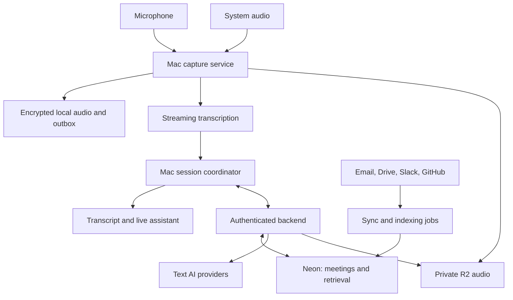

# Personal Meeting Copilot: Design and Requirements

Version 1.0 · September 15, 2026 · Owner: Kevin O’Connor

Status: implementation specification, not an implemented or benchmarked application. Requirements and performance numbers below are proposed targets. API capabilities are grounded in the linked vendor documentation; final model choices require measured evaluation.

## 1. Product Definition

A native macOS application that captures the user’s microphone and macOS system audio, transcribes the conversation live, and offers useful responses, alternative approaches, questions, and supporting facts while the meeting is happening. It retains audio, transcripts, summaries, and decisions, and retrieves relevant information from previous meetings, email, Google Drive, Slack, and GitHub.

The initial customer is Kevin. Optimize for personal usefulness in technical discussions, security reviews, leadership meetings, customer conversations, and general professional work. Other users may receive the app later if it proves useful. Do not build subscriptions, team administration, a public marketplace, or a web frontend before the personal tool works.

The defining experience: someone asks a question; a short answer and two meaningful alternatives appear with supporting context; Kevin can inspect the evidence or ask for more detail without losing the conversation.

### Confirmed Choices And Implementation Defaults

| Area | Decision |
| --- | --- |
| Client | Native Swift/SwiftUI macOS app; AppKit for the floating assistant panel |
| Initial platform | Apple Silicon; proposed minimum macOS 15; validate against the actual development Mac and supported SDK |
| Database | Neon PostgreSQL for authoritative synchronized structured data |
| Local persistence | Encrypted SQLite plus encrypted audio files and a durable sync outbox |
| Audio retention | Keep microphone and system tracks; retain until explicitly deleted or a user-configured retention rule applies |
| Cloud audio | Private Cloudflare R2 object storage; Neon holds manifests and object references |
| Live assistance | Frequent automatic suggestions, manual shortcut, and free-form chat |
| AI | Cloud-capable adapters; initially ElevenLabs streaming transcription and OpenRouter text generation; OpenAI and Cloudflare adapters remain supported integration targets |
| Historical context | Current session, previous meetings, uploaded files, email, Drive, Slack, GitHub within the selected context space |
| Backend | Small authenticated TypeScript API on Cloudflare Workers; asynchronous processing through Queues and Workers |
| Initial distribution | Personal developer build; signed/notarized direct distribution before sharing with others |
| Excluded from first version | Automatic speaking, meeting bots, continuous screenshots, video recording, automatic external writes |
| Client | Native Swift/SwiftUI macOS app; AppKit for the floating assistant panel |
| Initial platform | Apple Silicon; proposed minimum macOS 15; validate against the actual development Mac and supported SDK |
| Database | Neon PostgreSQL for authoritative synchronized structured data |
| Local persistence | Encrypted SQLite plus encrypted audio files and a durable sync outbox |
| Audio retention | Keep microphone and system tracks; retain until explicitly deleted or a user-configured retention rule applies |
| Cloud audio | Private Cloudflare R2 object storage; Neon holds manifests and object references |
| Live assistance | Frequent automatic suggestions, manual shortcut, and free-form chat |
| AI | Cloud-capable adapters; initially ElevenLabs streaming transcription and OpenRouter text generation; OpenAI and Cloudflare adapters remain supported integration targets |
| Historical context | Current session, previous meetings, uploaded files, email, Drive, Slack, GitHub within the selected context space |
| Backend | Small authenticated TypeScript API on Cloudflare Workers; asynchronous processing through Queues and Workers |
| Initial distribution | Personal developer build; signed/notarized direct distribution before sharing with others |
| Excluded from first version | Automatic speaking, meeting bots, continuous screenshots, video recording, automatic external writes |

Use “Meeting Copilot” as a working title only. This is not a branding decision.

## 2. Native Interface And Workflows

### Main Window

Use a native three-column layout with a standard sidebar, main content area, and optional inspector. Adapt to Light/Dark mode, keyboard navigation, VoiceOver, and larger text. Do not make an Electron or webview shell.

| Surface | Contents and actions |
| --- | --- |
| Sidebar | Live session, meeting history, people, projects, context spaces, connected sources, search |
| Live session | Transcript, compact rolling summary, bookmarks, detected questions, draft decisions and action items |
| Inspector | Selected transcript passage, related documents, source freshness, evidence, audio playback |
| Meeting detail | Editable summary, timestamped transcript, audio tracks, decisions, commitments, open questions, assistant history |
| Settings | Audio devices, providers, model roles, suggestion frequency, keyboard shortcuts, retention, data connections, sync and privacy |
| Menu bar | Recording state and elapsed time; start, pause both inputs, stop, show assistant, input health |
| Sidebar | Live session, meeting history, people, projects, context spaces, connected sources, search |
| Live session | Transcript, compact rolling summary, bookmarks, detected questions, draft decisions and action items |
| Inspector | Selected transcript passage, related documents, source freshness, evidence, audio playback |
| Meeting detail | Editable summary, timestamped transcript, audio tracks, decisions, commitments, open questions, assistant history |
| Settings | Audio devices, providers, model roles, suggestion frequency, keyboard shortcuts, retention, data connections, sync and privacy |
| Menu bar | Recording state and elapsed time; start, pause both inputs, stop, show assistant, input health |

The main window opens normally at launch. Use explicit SwiftUI scenes for the main window, settings, and menu bar. Keep session state in services rather than tying recording to a view’s lifetime. Closing the main window must not silently stop recording; quitting the app must resolve an active recording explicitly.

### Floating Assistant Panel

An approximately 420–520 px wide, resizable AppKit panel sits near the meeting window. It shows the current question/topic and up to three response cards. Native positioning, always-on-top preference, full-screen/Spaces behavior, and multiple displays need actual Mac testing.

Each card contains a 25–60 word primary suggestion, a label such as “Direct answer,” “Clarify,” “Alternative,” “Evidence,” or “Risk,” and an optional evidence drawer. Show up to two compact alternatives rather than three long paragraphs. Detailed reasoning and citations expand on demand.

Pin, copy, dismiss, regenerate, shorten, elaborate, and ask a follow-up are available without leaving the panel. Copy must not paste into the call’s chat field automatically. The panel does not take keyboard focus when new suggestions arrive. It freezes ordering while hovered, focused, selected, or pinned; newer cards queue behind a visible “new suggestions” indicator.

Screen-share exclusion may be explored as a tested convenience later. Do not promise invisibility or depend on it to protect confidential material. Keep sensitive detail collapsed; allow the user to position the panel on another display or hide it instantly.

### Before A Meeting

Start manually or open a suggested calendar meeting. Calendar integration is optional; ad-hoc use always works.

Select context space: EQTY, TKOResearch, or Personal, with separate source connections and histories.

Confirm microphone and system-audio scope with independent meters and a short test.

Show the applicable recording notice, retention, sync, and provider policy. Do not equate macOS permission with participant consent.

Add an agenda, desired outcome, role profile, reference files, or people. Prefetch relevant prior decisions and documents.

Start capture. Record the time actually started, independently of the calendar start time.

### During A Meeting

The default profile is Frequent: consider generating a new set of suggestions roughly every 8–12 seconds while new substantive speech is arriving, and promptly when a direct question or decision point appears. This is a configurable starting point, not a mandate to generate filler during silence.

Use event-driven triggers for questions, objections, inconsistencies, unfamiliar terms, commitments, decisions, missed agenda items, and relevant historical facts. Make automatic alternatives plentiful but distinct: direct answer, clarifying question, alternate approach, or cautious response when evidence is missing. Do not manufacture disagreement to fill an alternative slot.

Manual “Help me answer” requests preempt automatic work. The default shortcut is configurable and conflict-checked; use Control-Option-Space as an initial candidate. The same command is available through menus and the panel. The chat composer can scope a question to the current discussion or broader permitted history.

When Kevin starts speaking, let transcription and background reasoning continue, but avoid reordering the card he may be reading. “Pause suggestions” does not pause recording. “Pause recording” immediately stops both inputs, new transcription, and new AI requests and invalidates in-flight suggestion output.

### After A Meeting

Finalize recorded chunks, synchronize retained artifacts, generate a structured summary, and reconcile transcript spelling/speaker labels using a separate version. Present decisions, owners, deadlines, unresolved questions, and suggested follow-ups with evidence links. Unknown owners and dates stay unknown. A detected promise is a draft commitment until reviewed.

The user can correct names, merge/split speaker labels, edit notes, replay from a cited timestamp, and export Markdown, JSON, SRT/VTT, and audio with a manifest. Follow-up messages remain drafts within the app.

## 3. Functional Requirements

P0 = working personal release; P1 = connected-context release, still required for the requested complete tool; P2 = later expansion. P1 is sequencing, not removal from scope.

| ID | Priority | Requirement |
| --- | --- | --- |
| CAP-01 | P0 | Capture microphone and macOS system audio simultaneously as independent timestamped tracks |
| CAP-02 | P0 | Select microphone and system/application capture scope; show the exact active scope |
| CAP-03 | P0 | Show independent input meters, permission status, storage health, and recording/transcription/network states |
| CAP-04 | P0 | Survive device changes, transient capture failures, and network outages without silently dropping recorded audio |
| CAP-05 | P0 | Retain recoverable chunked audio locally and resume uploads after failure |
| CAP-06 | P0 | Pause/stop both sources immediately; start new sessions without merging adjacent meetings |
| TXT-01 | P0 | Stream provisional and committed transcript segments with timestamps and source track |
| TXT-02 | P0 | Distinguish “You” from remote audio; show anonymous speaker labels when identity is unknown |
| TXT-03 | P0 | Correct transcript text and speaker labels without overwriting original provider output |
| TXT-04 | P0 | Custom vocabulary for names, acronyms, products, and technical terminology |
| AI-01 | P0 | Frequent automatic response suggestions with up to two meaningful alternatives |
| AI-02 | P0 | Global help shortcut with priority scheduling and contextual answer generation |
| AI-03 | P0 | Streaming chat during and after meetings; selected-passage questions |
| AI-04 | P0 | Evidence links, uncertainty labels, contradiction warnings, and abstention when facts are unavailable |
| AI-05 | P0 | Concise answer, longer explanation, next question, objection response, and decision trade-off modes |
| AI-06 | P0 | Suppress stale, duplicate, off-topic, and superseded suggestions |
| AI-07 | P0 | User-editable role, tone, goals, and terminology; never fabricate user or company history |
| MEM-01 | P0 | Search and retrieve previous meetings within an explicit context space |
| MEM-02 | P0 | Rolling session state: agenda, entities, decisions, unanswered questions, commitments |
| MEM-03 | P1 | People/project history across meetings and connected sources with provenance |
| CON-01 | P1 | Read-only Gmail and Microsoft 365 email adapters; multiple separately scoped accounts |
| CON-02 | P1 | Google Drive document import and incremental synchronization, including supported shared drives |
| CON-03 | P1 | Slack channel/thread context within the token’s actual permissions |
| CON-04 | P1 | GitHub selected repositories, docs, issues, pull requests, reviews, and selected file contents |
| CON-05 | P1 | Source exclusions, inclusion windows, sync status, permission freshness, disconnect/purge |
| POST-01 | P0 | Audio playback linked to transcript, editable summaries, decisions, tasks, follow-up drafts |
| DATA-01 | P0 | Neon sync, local offline history, private audio object storage, resumable transfers |
| DATA-02 | P0 | Complete export and deletion across audio, transcripts, summaries, embeddings, and caches |
| OPS-01 | P0 | Provider configuration, per-meeting usage, spending limits, request diagnostics without content logging |
| DIST-01 | P0 | Personal Mac build and deterministic build instructions; credentials supplied outside source |
| DIST-02 | P1 | Signing, notarization, clean-machine install/uninstall, secure update strategy before distribution |
| FUT-01 | P2 | Web review app, iPhone companion, Windows client, team features, billing |
| FUT-02 | P2 | Optional explicitly triggered screenshots and opt-in local transcription/inference |

## 4. Architecture

The Mac owns capture, the live transcript, scheduling, and the UI. A small backend owns authentication, credential brokerage, synchronized data, indexing, provider policy, and jobs. Recording must not depend on a database connection or backend availability.

### Component Choices

| Component | Recommendation and reason |
| --- | --- |
| UI | SwiftUI scenes, Observation, native menus and split views; AppKit NSPanel where needed |
| Concurrency | Swift actors for session coordination and isolated mutable state; bounded nonblocking audio handoff queues |
| Capture | ScreenCaptureKit microphone/system outputs; AVFoundation for conversion, file writing, playback, and input fallback |
| Local database | SQLite through a maintained Swift wrapper; SQLCipher or an equivalently reviewed encryption integration; Keychain-protected key |
| Audio files | Independently finalized compressed chunks, encrypted before disk commit; cryptographic integrity metadata in a manifest |
| Network | URLSession WebSocket for STT where supported; URLSession streaming for text responses and authenticated API calls |
| Backend | TypeScript, Hono-style lightweight routing, schema validation, migrations and query layer for Neon |
| Live API | Bounded streaming HTTP responses for text requests; token brokerage for direct STT sessions |
| Jobs | Cloudflare Queues plus Workers for sync/indexing, summaries and retries; schedule/poll jobs only as needed |
| Database | Neon Postgres, full-text search, pgvector, transactional authorization boundaries |
| Object storage | Cloudflare R2 private bucket, scoped upload grants, authenticated playback |
| Authentication | OIDC authorization-code flow with PKCE, system browser login, securely validated callback, revocable device sessions |
| Secrets | Keychain for local device secrets; backend secret store for shared API and connector credentials |
| Packaging | Xcode app target with small Swift modules; Developer ID distribution when shared |

Direct STT uses a server-issued short-lived/single-use credential where the provider supports it; otherwise use an authenticated relay. Never embed a service-wide provider key or Neon database URL in the application. Personal BYOK can be an explicit optional mode with the key in Keychain; shared distribution always uses the backend credential boundary.

Do not add Redis, a separate vector database, or a persistent session server initially. If a provider requires a persistent server-side audio relay, evaluate a Durable Object or a small container behind an adapter. Cloudflare documents WebSocket support in Durable Objects, but an actively streaming upstream provider connection must not be assumed to hibernate. Cloudflare WebSockets

## 5. Audio Engineering

Apple documents separate microphone and system-audio outputs on ScreenCaptureKit streams, with microphone device selection. Use these public APIs and native permissions. The capture prototype must validate audio-only operation and application filtering on supported OS versions; do not retain screen frames to accomplish an audio requirement. Apple ScreenCaptureKit session

### Capture And Timing Contract

Assign every audio buffer a meeting ID, track ID, stream epoch, sequence number, sample format, sample count, and media timestamp. Preserve timestamp gaps explicitly.

Map both streams to a monotonic meeting timeline. Wall clock is metadata for display and calendar correlation, not the audio synchronization clock.

Separate archival writing from transcription conversion. Archive at a tested native rate; convert a copy to the provider’s required PCM format and rate.

Target 48 kHz archival processing where supported; do not assume device rates match or microphone/system channels have the same format.

Preserve microphone and system tracks separately. Produce a mixed playback/export track as a derivative; never use a mix as the only retained original.

Start with two STT streams so local/remote separation survives recognition. Multiple people on the remote track still require diarization and must not be assigned names from the roster without evidence.

Local capture callbacks do no networking, database I/O, encoding, or blocking waits. Use bounded handoff queues and off-thread processing.

Prioritize archival writes over live STT under pressure. If data is lost anywhere, record the exact affected interval and show degraded status.

### System Audio Is Broader Than The Call

Offer Whole system and Selected app modes. Exclude the copilot’s own playback where supported to prevent self-transcription. Browser process capture may include other tabs and helper processes; do not promise per-tab isolation from generic system capture. Clearly identify the capture scope before recording. Protected content and OS restrictions may prevent capture.

Meeting mute often does not mute the microphone input available to this app. Display “Mic captured even when the meeting app is muted” in onboarding and make local mic pause obvious. A mic meter cannot establish that the remote app can hear Kevin.

### Echo, Overlap, And Devices

Test built-in microphone/speakers, USB headset, USB microphone, AirPods/Bluetooth, HDMI/display output, and device disconnect/reconnect. Speaker playback can leak remote speech back into the microphone; retain the original recordings, apply echo handling on the recognition path, and use conservative cross-track deduplication. Never remove simultaneous similar speech purely because the text matches.

Do not claim reliable remote-person diarization in the live release without a measured provider capability. “You” versus “Remote speaker” is acceptable; Speaker A/B and edited names improve it when supported. Post-meeting diarization may be a separate provider job.

### Resilient Retention

Proposed default: finalize independently decodable 2-second archival chunks in bounded memory, encrypt each chunk with authenticated encryption before committing it to the local journal, then package multiple encrypted chunks for efficient upload. Use a reviewed crypto library with unique nonces and explicit key versions; never create a plaintext audio staging file. A crash can lose the currently open chunk but must not corrupt finalized chunks. Measure whether this cadence is efficient on the target Mac before locking it.

Each chunk has source track, time range, epoch, sequence, checksum and upload status. Upload idempotently. An upload acknowledgment means the backend verified the object and recorded its manifest. Keep a local copy until acknowledged; default offline audio cache is 30 days after acknowledgment, while the cloud archive remains retained. Allow pinning local audio and retaining all locally when desired.

Sleep, shutdown, capture permission loss, full disk, and process failure create explicit stopped/interrupted states. Recording cannot continue while the Mac is asleep. Network failure keeps local recording running; live cloud answers are marked unavailable, and audio is queued for later transcription. Recovered historical audio must not trigger old “live” suggestions.

## 6. Transcription And AI Pipeline

ElevenLabs documents WebSocket transcription with provisional/committed text and single-use client tokens. That makes it a concrete first STT integration candidate, not proof that it is fastest or best on Kevin’s terminology. ElevenLabs streaming guide

| Role | Initial implementation | Selection criteria |
| --- | --- | --- |
| Live STT | ElevenLabs Scribe realtime adapter | End-to-end latency, technical-term errors, timestamps, reconnects, two-stream cost |
| STT alternative | OpenAI adapter; Cloudflare candidate if the chosen endpoint supports the required streaming behavior | Same recorded fixtures and live sessions; do not equate batch STT with live streaming |
| Fast assistance | Configurable low-latency model through OpenRouter | Short useful answers, streaming, structured output, groundedness, latency |
| Deeper answer | Configurable stronger model through OpenRouter or direct OpenAI | Technical reasoning and citation quality within a larger response budget |
| Summaries | Separate asynchronous model role | Coverage, accurate ownership/dates, contradictions, cost |
| Embeddings | One pinned embedding model/version initially | Retrieval quality, supported dimensions, storage and migration cost |
| Optional local mode | Later adapter after cloud workflow is proven | Measured quality and speed; no silent cloud fallback |

Model identifiers are configuration, not business logic. Record model ID, provider endpoint, policy version, prompt version, latency and usage for every request. Cloudflare’s model catalogue is a candidate source for embedding, classification and inference; verify capabilities per endpoint at implementation time. Workers AI models

### Processing Sequence

Receive partial transcript; render it as provisional. Committed segments enter a versioned transcript ledger.

Update a structured rolling state using recent committed content: active topic, questions, entities, decisions, commitments, and unresolved issues.

Detect meaningful events and schedule assistance. Debounce incremental edits; do not call a large model for every token.

Assemble context from the latest 60–120 seconds, compact session state, role/agenda, and a small set of permission-filtered evidence excerpts. Retrieve more only when useful.

Generate a concise answer and alternatives in one response when possible. Default Frequent mode permits one new automatic set per 8 seconds and one outstanding automatic request; manual requests have priority.

Validate the output schema, cited source IDs and versions, policy, and transcript generation. Reject fabricated citations; label unsupported factual assertions or replace them with a clarification.

Display the first useful response quickly. Evidence-based refinement can arrive afterward as a separate update, without changing a pinned answer.

Partial text may trigger speculative work for lower latency, but displayed answers must indicate when the question is still being transcribed. Invalidate speculative output when the committed transcript materially differs. A corrected name or negation is enough to require re-evaluation.

### Suggestion Contract

Every suggestion includes ID, meeting ID, originating transcript revision, question/topic, creation time, expiry, category, primary response, alternatives, evidence references, uncertainty/missing context, model provenance, and lifecycle state. States include generating, current, pinned, superseded, dismissed and expired.

Use clear evidence states: “Supported by source,” “Based on this discussion,” “Inference,” or “Needs verification.” Avoid invented numeric confidence percentages. Source references contain exact document version or meeting segment and time range. A valid citation establishes traceability, not that the source is true; preserve conflicting sources and dates.

Suggested responses must not assert completed remediation, certification, contract commitments, or product behavior from absence of evidence. “I’ll verify the implementation and follow up” is preferable to invented certainty. A hypothetical example is acceptable only when labeled as such.

If a request times out, cancels, changes topic or crosses a pause/stop boundary, late responses must not reappear. Cap automatic answer length and show a distinct slower “Deeper analysis” action. Frequent suggestions should add information, not keep rephrasing the same advice.

## 7. Connected Memory And Retrieval

“All previous meetings and connected resources” means searchable within the active space and granted source scope. It does not mean sending an entire mailbox or company history in every prompt.

### Context Isolation

Create separate EQTY, TKOResearch and Personal spaces, even with one user. Every meeting, document, source token, embedding, generated memory and provider policy belongs to a space. The meeting’s active space is always visible. Cross-space retrieval is off by default and requires explicit selection of additional allowed spaces for that query/session.

Permission to read a document is distinct from permission to send its contents to an AI provider or disclose them in a meeting. Capture audience and sensitivity metadata where known. Flag suggested responses that rely on private/internal sources in an external meeting. Ambiguous classification is visible; do not claim automatic classification guarantees safe disclosure.

### Connector Requirements

| Source | Read scope and content | Synchronization and provenance |
| --- | --- | --- |
| Email | Gmail first; Microsoft Graph adapter next; selected account, mailbox/folder/label/date range; messages and permitted attachments | Preserve thread, sender, recipients, timestamps, message ID, source URL and access state; delta/history sync and periodic reconciliation |
| Drive | Selected files/folders/shared drives; Docs export, supported PDF/text/office extraction | Stable file ID, revision/content hash, modified time, owner and permission scope; change cursor plus reconciliation |
| Slack | Selected channels and accessible threads; private channels/DMs only if explicitly enabled and token-permitted | Workspace/channel/message/thread IDs, edits/deletions, permalinks, synchronization coverage |
| GitHub | Selected repos; documentation, issues, PRs, reviews and selected source files | Repository ID, commit SHA or issue/comment revision, permalink, permission state; webhook plus incremental polling |
| Meetings | Current and previous sessions in permitted spaces | Audio timestamps, transcript version, summary version, participant labels, recording date |
| Manual files | User-chosen uploads | Content hash, title, version, ingest date; explicit space assignment |

Connector inclusion filters are application controls, not necessarily narrow OAuth scopes. Show that distinction. Never request source write scopes just to create an in-app draft. Do not scrape local Slack/browser databases or reuse unrelated app session cookies as a connector shortcut.

Gmail’s read-only mailbox scope is classified as restricted. Public distribution and server-side handling may introduce verification/security-assessment requirements, subject to applicable exceptions. Recheck those requirements before expanding beyond personal/internal use. Gmail scopes

Slack access depends on app type, scopes, workspace policy and rate limits. Design resumable, rate-aware synchronization rather than promising immediate complete history. Slack rate limits

Retrieval behavior

Use PostgreSQL full-text search plus vector similarity, fuse rankings, and optionally rerank a small candidate set. Exact identifiers, names and acronyms need lexical retrieval. Start with exact vector scans for a small corpus; add an approximate index when measured volume justifies it, and test filtered recall. pgvector supports vector retrieval within Postgres. pgvector documentation

Chunk documents along headings and messages along meaningful thread boundaries. Preserve citations and surrounding context. Initial excerpt budget: roughly 4–8 relevant chunks, adjustable under a fixed prompt budget. Prefer recent, authoritative material, but show older contradictory decisions when relevant.

Record source modification time, last sync time, access-check time, content version, deletion state, and indexing status. Enforce access before candidates reach prompts, not after generation. Revalidate connector access for live retrieval; proposed authorization-cache TTL is at most 5 minutes, with a strict mode requiring a fresh check and excluding sources if verification is unavailable. Source permission events invalidate the cache immediately when delivered. On revocation, exclude cached source content and its derived memories. Offline use of connector content requires an explicit policy permitting cached access and a visible stale-access label.

Disconnect immediately blocks new retrieval and sync and invalidates credentials. Offer deletion of already imported material; source-backed derived facts must preserve lineage so revocation/deletion can remove them too. Independent user-owned meeting records remain governed by their own retention, rather than being silently deleted with a connector.

## 8. Data Model And Synchronization

All content tables carry workspace/space scope and an owner or an explicit access relationship. Begin with one user but enforce scope consistently from the first schema. Use UUIDs generated on the client for offline creation; timestamps are UTC with per-meeting display timezone.

| Entity | Key fields and purpose |
| --- | --- |
| users, devices, sessions | Identity, device enrollment, revocation and authentication session |
| spaces, space_members | Context boundaries, permitted providers, retention policy |
| meetings | Space, title, actual/planned start/end, state, agenda, sensitivity, version |
| participants | Meeting-local label, optional resolved person, source and verification status |
| audio_tracks | Meeting, source type, device, codec/rate/channels, timeline mapping |
| audio_chunks | Track, epoch/sequence, time range, checksum, private object key, upload state |
| transcript_segments | Track, provider segment ID, start/end, provisional/final status, revision |
| transcript_edits | Original segment reference, corrected text/speaker, actor, time |
| meeting_summaries | Meeting, version, generating transcript revision, structured content |
| decisions, action_items | Evidence, proposed/confirmed state, nullable owner/due date |
| suggestions, assistant_messages | Context revision, answer, alternatives, source links, lifecycle |
| connectors, sync_cursors | Provider/account, secret reference, selection rules, sync/access state |
| documents, document_versions | External ID, content hash, source URL, ACL snapshot, freshness |
| document_chunks, embeddings | Version/space, searchable text, embedding model/version/dimension |
| evidence_links, memory_facts | Source lineage, claim status, time validity and supersession |
| sync_operations, jobs | Idempotency key, state, retries, error, server acknowledgment |
| usage_events, audit_events | Metadata-only diagnostics, access/export/deletion and cost |
| deletion_jobs, tombstones | Removal propagation and prevention of stale-device resurrection |

Neon stores structured records and searchable text; R2 stores audio and larger imported assets. Local SQLite stores the active meeting, authorized recent history, search cache and durable outbox. Audio uploads and metadata sync are separate recoverable operations.

Every server mutation has an idempotency key. Use optimistic versions for editable titles/notes; conflicting edits preserve both versions for resolution. Transcript ingestion is append/revise using provider IDs and stream epochs, never last-writer-wins text replacement. Tombstones outrank stale uploads so deleted meetings cannot reappear after an offline device reconnects.

Object keys are opaque. The backend authorizes every object grant against the authenticated user and space; possession of an object ID is not authorization. Deletion invalidates grant issuance immediately; already-issued short-lived URLs have a bounded residual lifetime. Keep media read grants short and use an authenticated proxy where immediate revocation is required.

Private R2 provides the object-storage layer; storage architecture and access checks here are application requirements. Backend post-processing that needs encrypted audio must use a deliberately authorized decrypt path with wrapped per-meeting keys; the metadata database must not contain unwrapped audio keys. Playback/export decrypts authorized chunks on the Mac. Deleting a key is not a substitute for tracking and removing objects and backup copies. Cloudflare R2

## 9. Security And Privacy Requirements

Use a non-owner, non-BYPASSRLS database role for application queries, force RLS on scoped tables, and set authenticated scope transaction-locally. Never trust a client-provided owner/space ID without checking membership. Migrations use a distinct privileged role.

Encrypt local audio and database content with reviewed primitives; keep keys in Keychain. FileVault is recommended device protection, not a substitute for the app’s key design. Resolve encrypted SQLite packaging/licensing early.

Use TLS and provider/storage encryption for cloud data. The cloud retrieval service necessarily processes readable indexed content; do not describe this architecture as end-to-end encrypted against the operator. True local-only encrypted retrieval would require a separate operating mode.

AI provider policies are explicit per space: allowed model endpoints, permitted retention, region where required, logging, and fallback list. OpenRouter supports provider allowlists and retention filters; configure them rather than using unconstrained default routing. If no permitted endpoint is available, fail closed for inference and continue recording. OpenRouter routing

Raw audio/transcripts, tokens, prompts and completions are excluded from general logs and crash reports. Usage records hold counts, latency, provider IDs and non-content errors. Opt-in diagnostic export shows a reviewable manifest and redaction preview.

Retrieved documents and spoken content are untrusted data. Instructions embedded in them cannot change app policy, connector scope, provider destination, or tool permissions. The model receives retrieval-only capabilities; sending messages and arbitrary network access are outside the first release.

Use a bounded parser/indexing pipeline. Reject oversize/decompression-bomb files; do not execute attachments, macros or repository code. Remote links are not followed automatically; server fetches use connector APIs or an allowlist with SSRF defenses.

Redact likely credentials from model-bound text and suggested responses using a local detection layer; allow intentional source inspection. Detection is best-effort. Because cloud STT receives audio before text redaction, this does not guarantee spoken credentials stay off-provider. The retained original audio may still contain the secret.

Clearly indicate when mic/system capture is active and make pause/stop available from all live surfaces. Permission loss produces an actionable degraded state. Optional meeting detection prompts to start; it does not authorize ambient recording.

Retain transcripts, summaries and audio as requested. Make deletion work across local files, objects, indexes, source-backed generated artifacts and caches. Published exports are outside recall. Backups and provider retention have separate documented expiry; never promise instantaneous deletion of all backups.

Preserve the distinction between recording, transcription and AI state. “AI unavailable” must not imply recording stopped; “Recording paused” must actually stop collection.

Before distributing: signed/notarized build, authenticated secure updates, dependency inventory, clean install, permission handling, connector verification review and cross-account isolation tests. Sharing the app does not share Kevin’s data or credentials.

## 10. Performance And Acceptance Criteria

These are release targets, not vendor promises. Measure on Kevin’s actual Mac with realistic Zoom, Teams, Meet and Slack huddle workloads. Record the device, OS, provider/model, network, language and audio route for every run. Test native and browser variants separately.

| Area | Proposed acceptance criterion |
| --- | --- |
| Recording independence | Both streams present in a 60-minute controlled fixture; no unexplained missing intervals; track skew remains within 100 ms |
| Recording independence during outage | A 10-minute network outage preserves both local tracks; resumable sync completes without duplicate chunks |
| Crash recovery | Forced termination recovers all finalized chunks; unrecoverable tail at most the configured chunk interval, with a visible gap |
| Transcript latency | Speech-to-first-readable-partial p95 ≤1.5 s; end-of-utterance-to-commit p95 ≤2.5 s |
| Answer latency | Shortcut-to-first-useful text p95 ≤3 s with prepared context; short answer set p95 ≤6 s |
| Automatic response | Direct-question end to first useful suggestion p95 ≤4 s when cloud services are healthy |
| Retrieval | Permission-filtered indexed lookup p95 ≤800 ms on a defined 100k-chunk fixture; warm and cold paths reported separately |
| STT quality | Starting target ≤15% WER on a manually labeled technical-call fixture and ≥90% recall on an agreed key-term list; report overlap separately |
| Groundedness | No fabricated citation IDs; zero unsupported high-impact company claims in the curated safety fixture; measure usefulness separately |
| Suggestions | At least 80% of suggestions marked relevant on a 100-event replay evaluation; fewer than 10% near-duplicates |
| Interaction | No unsolicited keyboard focus changes; pinned cards never displaced; all core actions keyboard accessible |
| Resource use | Four-hour call without unbounded memory/queue growth; initial RAM target <1 GB excluding optional local models; profile CPU, thermal load and battery |
| Stop/pause | Capture callbacks stop feeding archival/STT buffers promptly; target ≤250 ms; already-transmitted provider data cannot be recalled |
| Revocation | Immediate exclusion after app disconnect; upstream permission changes handled within configured recheck bounds, with stale state visible |
| Deletion | Deleted meeting absent from normal reads immediately; online copies/indexes removed within 24 h; offline devices purge on reconnect; backups follow recorded expiry |
| Isolation | No cross-space/cross-user records, snippets, embeddings or audio access in adversarial authorization tests |
| Exports | Transcript timestamps resolve to playable audio; manifest includes versions and gaps; exported data round-trips without losing source identity |

Create test fixtures for overlapping speech, corrected negation, ambiguous speaker names, unrelated system audio, muted meeting microphone, prompt injection in a document, stale remediation claims, revoked connector access, rate limiting, token expiry, queue overflow and exhausted disk. Recordings used for testing must be approved/synthetic and stored separately from production data.

## 11. Cost Controls

Do not select a provider solely from advertised token prices. Track cost per meeting-hour, first useful answer latency, key-term accuracy and accepted suggestions.

At an 8–12 second automatic cadence, an active hour can generate roughly 300–450 suggestion requests before manual queries. Two independent STT streams can also approach two billable stream-hours per meeting-hour, depending on provider billing and silence handling. Use compact rolling context, caching where available, and one request producing multiple alternatives; avoid invoking three models for every card.

Expose a per-session estimate and per-month usage page. Set configurable soft warnings and a hard inference budget. When exhausted, pause paid inference visibly while local recording continues; do not silently discard audio or enable another billable provider.

For storage planning, two retained mono tracks at 64 kbps each use approximately 57.6 MB/hour in decimal units, excluding containers, encryption, chunk and metadata overhead. At 100 meeting-hours/month, that is approximately 5.76 GB/month before any additional derivative mix or local duplicate. Actual bitrate/quality is a prototype decision, not a preservation guarantee.

Total monthly cost = STT usage + generation tokens + embeddings/indexing + Neon compute/storage + R2 storage/operations + backend requests/jobs. Store a versioned price configuration and mark estimates when a provider does not return authoritative usage. Do not hardcode a cost promise into the product.

## 12. Build Sequence And Release Gates

| Milestone | Deliverable | Exit gate |
| --- | --- | --- |
| 0. Capture prototype | Minimal native app with both tracks, meters, playback, chunk journal and device selection | 60-minute capture, headphones/speakers/Bluetooth transitions, permission interruption and crash recovery work |
| 1. Live copilot | STT, floating panel, frequent alternatives, help shortcut, chat, role profile, cancellation | Useful answers within latency targets; no focus theft; recording survives provider failure |
| 2. Persistent personal tool | Neon/R2 sync, encrypted local data, history, search, summaries, exports, deletion, scoped auth | Can use daily, recover outages, search prior meetings and export complete recordings |
| 3. Connected context | Drive and Gmail, then Slack and GitHub, then Microsoft 365 email; source lineage and context-space rules | All requested connectors work within actual permissions; incomplete history visible; retrieval and revocation tests pass |
| 4. Shareable build | Signing/notarization, installation, migration/recovery, secure updates, user isolation | Second user can install without inheriting Kevin’s credentials, history, defaults or source grants |
| 5. Optional expansion | Web review, additional desktop/mobile platforms, local AI, team collaboration | Only after measured personal usefulness and a concrete need |

Avoid calendar sync or connector work blocking the first real meeting test. Audio capture and response usefulness are the two largest early risks. A beautiful UI with unreliable system audio or answers that arrive after the topic changes is not a usable release.

### Suggested Source Structure

| Path | Responsibility |
| --- | --- |
| `macOS/App` | Application entry, scenes, lifecycle |
| `macOS/Features/LiveSession` | Transcript view, panel, composer and session controls |
| `macOS/Features/History` | Meeting review, playback, search and exports |
| `macOS/Features/Settings` | Devices, providers, sources, retention and profiles |
| `macOS/Services/Audio` | Capture, timing, conversion, chunk writer, playback |
| `macOS/Services/Transcription` | STT provider protocols and adapters |
| `macOS/Services/Assistance` | Scheduling, context state, suggestion lifecycle |
| `macOS/Services/Sync` | Local outbox, resumable uploads, deletion propagation |
| `macOS/Models` and `macOS/Stores` | Typed domain models, encrypted persistence |
| `backend/api` | Auth, retrieval, provider brokerage, object grants, sync endpoints |
| `backend/jobs` | Connector sync, parsing, embedding, reconciliation and summaries |
| `backend/db` | Schema, migrations, RLS, query layer |
| `contracts` | Versioned API and event schemas |
| `fixtures` and `tests` | Audio fixtures, failure injection, retrieval/grounding and authorization evaluations |

Decisions to settle through implementation evidence

Exact live and deep models; STT provider after an audio comparison; minimum supported OS after capture testing; the archived audio codec/bitrate; encrypted SQLite integration; the identity provider; email account types; actual connector grant availability; backend request limits under long answers; and how much Frequent mode helps versus distracts during real meetings. These are bounded implementation choices, not blockers to starting the capture prototype.

The complete requested tool includes both audio sources, retained recordings, all three live-assistance modes, persistent history and the connected sources. Later distribution and the web frontend remain optional.
